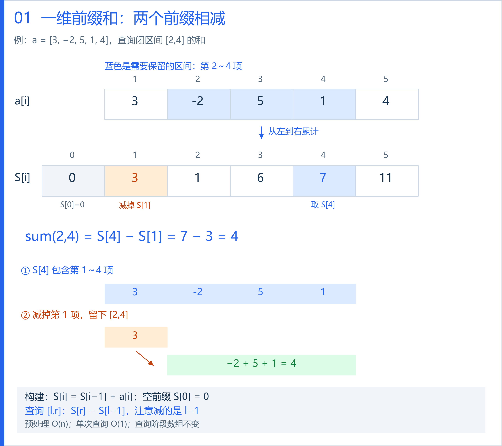
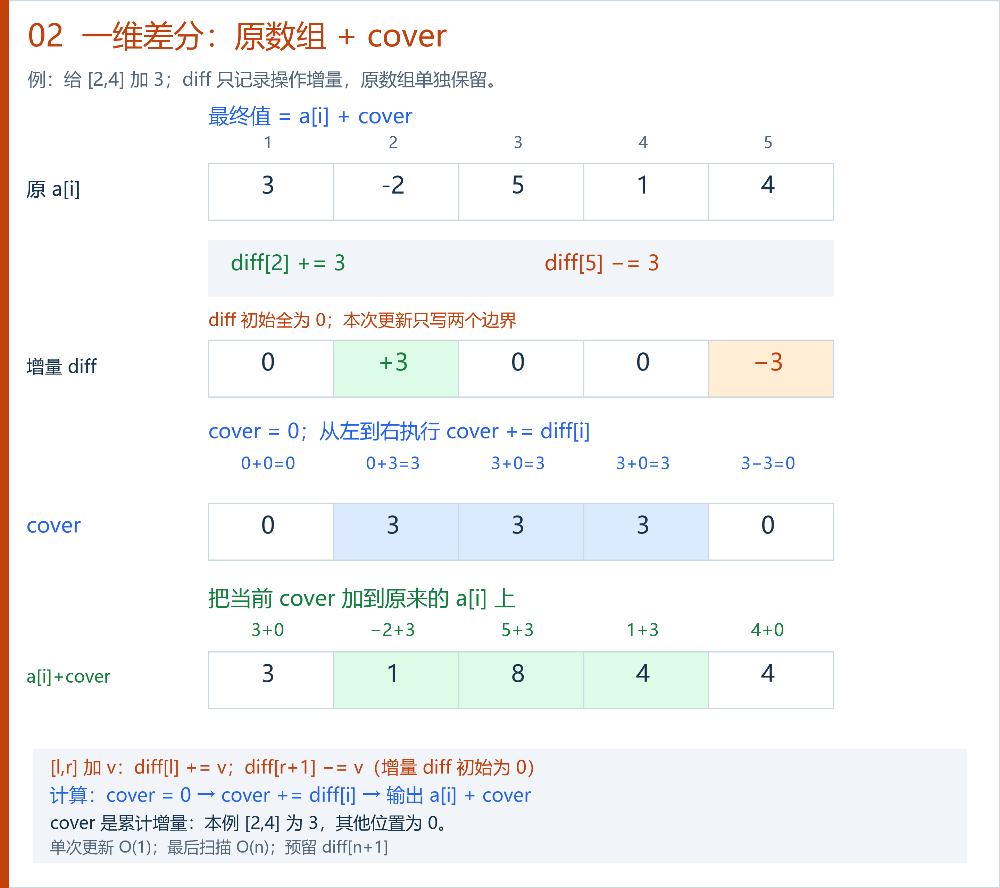
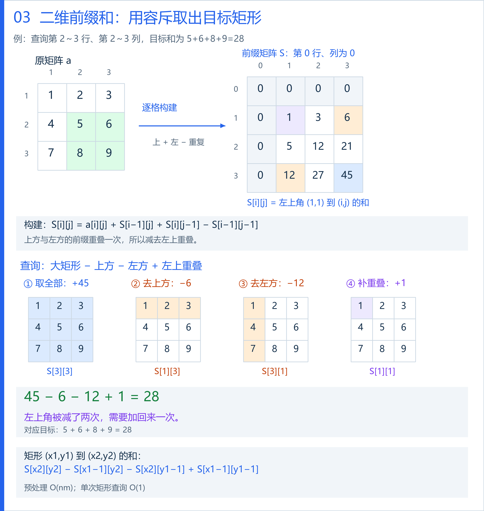
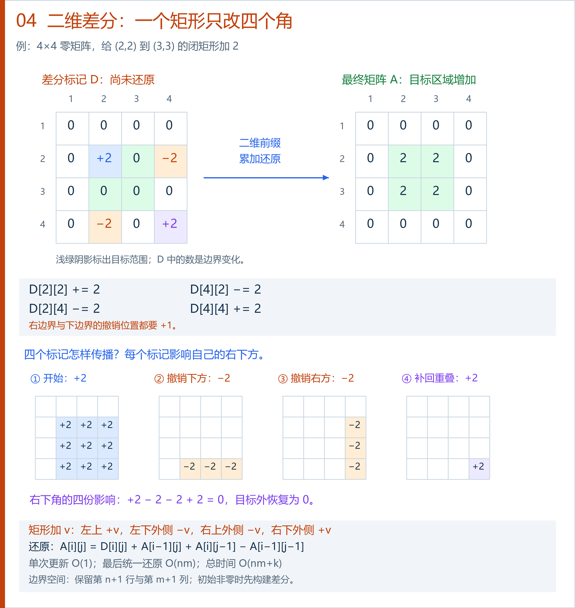

# 前缀和与差分讲解图

可编辑原图：[[Excalidraw/Drawing 2026-10-09 14.25.31.excalidraw.md|打开 Excalidraw 画布]]。

详细讲义：[[前缀和与差分讲义]]。

四张图统一使用 1 下标与闭区间。每张图包含数值例子、颜色标记、公式和复杂度。

## 一维前缀和

先取到右端点的前缀，再减去左端点之前的前缀。本例查询 `[2,4]`，得到 `7−3=4`。

## 一维差分

区间加法只改两个边界。本例给 `[2,4]` 加 3，记录 `D[2]+=3`、`D[5]-=3`，累计后得到最终数组。

## 二维前缀和

矩形和按“大矩形−上方−左方+左上重叠”计算。本例得到 `45−6−12+1=28`。

## 二维差分

矩形加法记录四角 `+ − − +`。本例给 `(2,2)` 到 `(3,3)` 加 2，下边界和右边界的撤销位置都在第 4 行或第 4 列。

